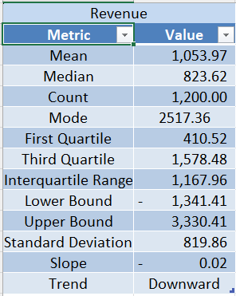
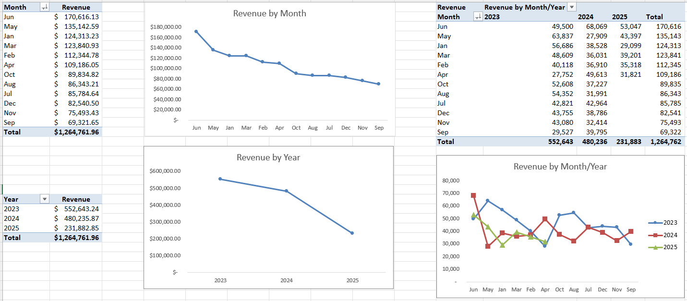
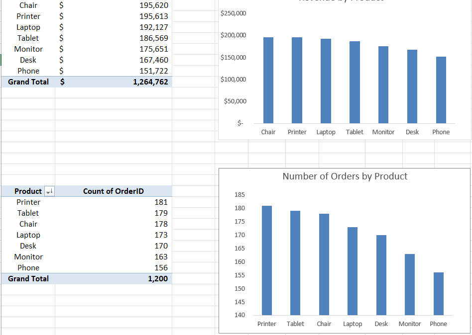
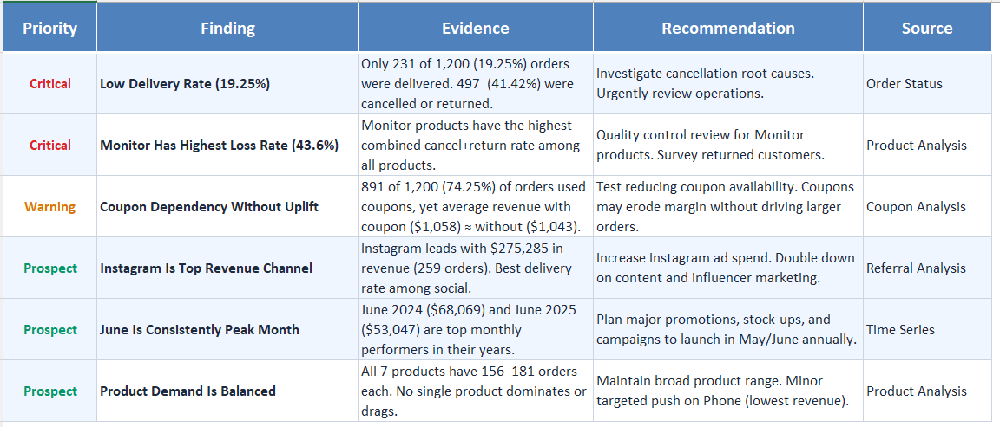

# sales-data-eda-decodelabs
Exploratory data analysis on 1,200 sales orders — Data Analytics internship project at DecodeLabs

## Process
1. **Data Cleaning** — handled missing values, standardized date formats, removed duplicates
2. **Statistical Analysis** — mean, median, mode, IQR, outlier detection (Z-score & IQR methods), standard deviation
3. **Time Series Analysis** — monthly/quarterly revenue trends, MoM and YoY comparisons
4. **Product & Categorical Analysis** — revenue by product, payment method, referral source, order status
5. **Insight Generation** — prioritized findings (Critical / Warning / Positive) with business recommendations

## Key Findings

### Statistical Summary

### Monthly Revenue Trend

### Revenue by Product

### Key Insights & Recommendations

## Tools Used
- Microsoft Excel — PivotTables, statistical formulas, charting
- Statistical methods: IQR & Z-score outlier detection, correlation analysis

## Related Projects
- [SQL Sales Analysis](https://github.com/dedejacksona/sql-sales-analysis-decodelabs) — SQL queries on the same underlying dataset

## How to View
Download `analysis/Dataset_for_EDA.xlsx` and open in Excel — each sheet is 
tabbed and labeled (Original Dataset → Cleaned → Statistical Analysis → 
Time Series → Product → Categorical → Key Insights).

---
*Completed as part of a Data Analytics Internship at DecodeLabs.*
